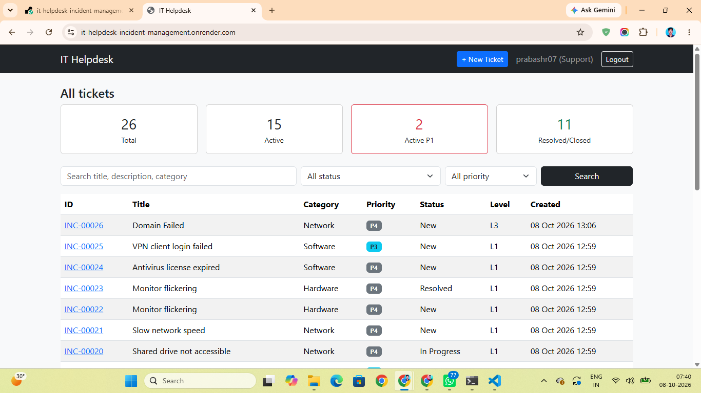

# IT Helpdesk & Incident Management System

A Django-based service desk portal where users log IT incidents (hardware, software, network) and support staff track, prioritise, escalate and resolve them.

**Live demo:** https://it-helpdesk-incident-management.onrender.com/

> Hosted on Render's free tier, so the first load after inactivity can take about a minute. Sample data is re-created automatically on restart.

## Demo Login
- Regular user: `demo_user` / `Demo@12345` (can log tickets and view only their own)
- Support staff (admin) credentials are private. Run locally to explore the support view.

## Features
- User registration and login
- Incident logging by category
- Priority matrix (Impact x Urgency) giving P1 to P4
- Automatic routing to support level (L1, L2, L3)
- Status updates and ticket escalation by support staff
- Full ticket history (audit trail)
- Search and filter by text, status and priority
- Dashboard counts: total, active, active P1, resolved
- Django admin for categories and ticket management

## Priority Matrix

| Impact \ Urgency | High | Medium | Low |
|---|---|---|---|
| High | P1 (L3) | P2 (L2) | P3 (L1) |
| Medium | P2 (L2) | P3 (L1) | P4 (L1) |
| Low | P3 (L1) | P4 (L1) | P4 (L1) |

## Tech Stack
Python, Django, SQLite3, HTML5, CSS3, Bootstrap 5, Gunicorn, WhiteNoise, Render

## Screenshots

### Dashboard and ticket list


## Run Locally
```bash
git clone [https://github.com/rprabash7/it-helpdesk-incident-management.git](https://github.com/rprabash7/it-helpdesk-incident-management.git)
cd it-helpdesk-incident-management
python -m venv .venv
.venv\Scripts\activate
pip install -r requirements.txt
python manage.py migrate
python manage.py createsuperuser
python manage.py seed_tickets
python manage.py runserver
```
Open http://127.0.0.1:8000/

`seed_tickets` creates 25 sample tickets and a `demo_user` account for testing.

## Run Tests
```bash
python manage.py test
```
The suite has 13 tests covering all 9 impact/urgency combinations of the priority matrix, level routing, escalation limits, ticket history, role-based access, search and dashboard counts.

## Author
Prabash R